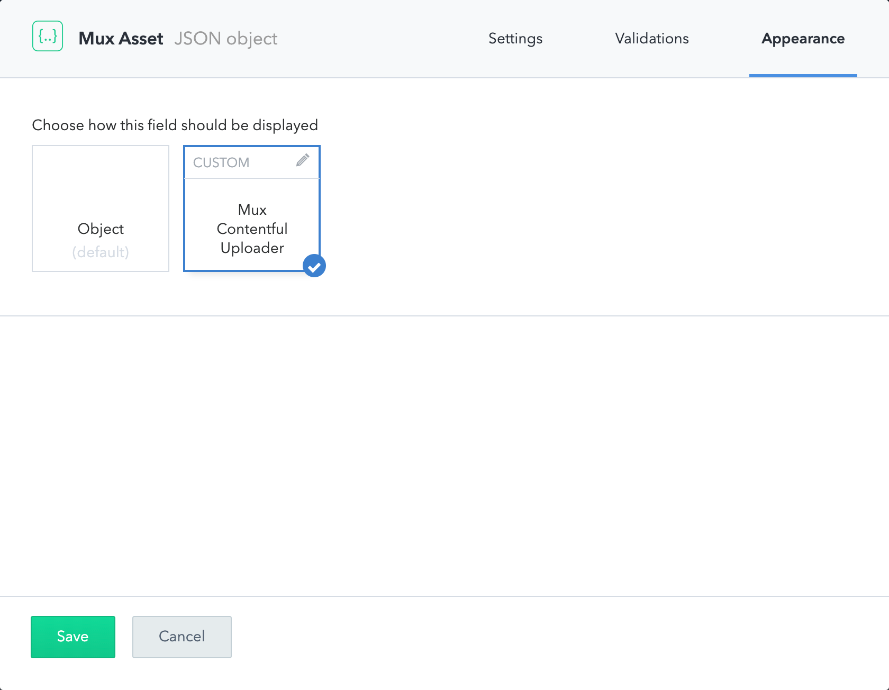

# Contentful Video Streaming Plugin

A Contentful UI extension that makes it simple to add beautiful streaming via [Mux](https://https://mux.com) to your [Contentful](https://contentful.com) project. Just install the extension, add the component to your content model, and you're good to go! 🙌🏾

Before getting started, make sure to generate a new [Access Token](https://dashboard.mux.com/settings/access-tokens). To make installation a little easier later, you can save the generated environment file as `.env` in this directory. If you're going to install the plugin [via the interface](#install-via-the-contentful-interface), just keep the token ID and secret handy.

## Install via the CLI

Make sure you have the Contentful CLI installed:

```
npm install contentful-cli -g
```

You are logged in:

```
contentful login
```

And have a space selected:

```
contentful space use
```

To install the UI Extension:

```
npm run install-extension
```

To update the UI Extension:

```
contentful extension update --force
```

Note: by default this installs the hosted version of our extension. If you'd like to self-host this extension, you may update `extension.json` to use your own `src`, but keep in mind you'll need to have your own solution for handling CORS requests.

## Install via the Contentful interface

Navigation to Space settings > Extensions, then click "Add new".

Make sure `src` is checked, then set the value to `https://contentful.mux.dev/extension`.

## Setting up your content model

Create a new JSON field in the model you'd like to add Video to. Name the field something useful and descriptive like, for example "Mux Asset".

Click on the "Appearance" tab.

Select "Mux Contentful Uploader"



Congratulations, now you've got your very own best-in-class video platform! 🤘🏻

## Using your new Video field in clients

The Mux Asset JSON object you'll get in your clients will look like this:

```
{
  "uploadId": "some-upload-id",
  "assetId": "some-asset-id",
  "playbackId": "a-public-playback-id"
  "ready": true
}
```

Both `uploadId` and `assetId` are things we need to manage the asset in the Mux API. `playbackId` is what you'll use in your player. If you want help setting up a player, we have a set of [guides](https://docs.mux.com/docs/playback) to help you get started.

## Talk to us!

This extension was made with 💖 by the folks from [Mux](https://mux.com). If you have any questions or feedback, [let us know](mailto:help@mux.com)!
